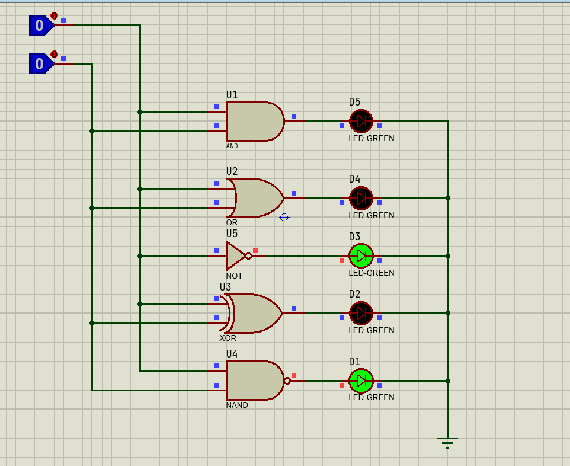
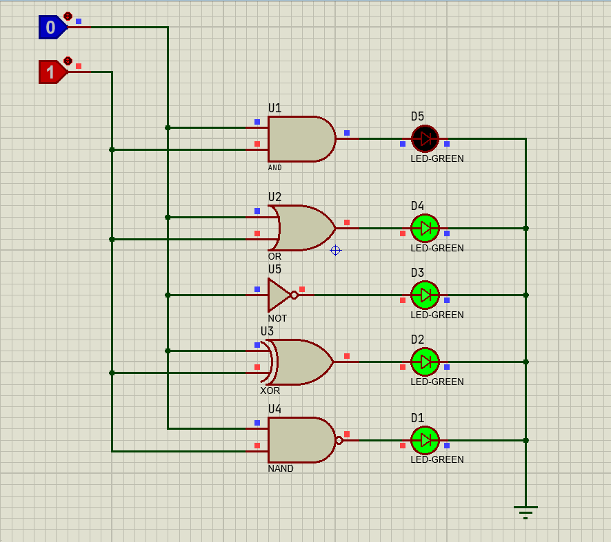
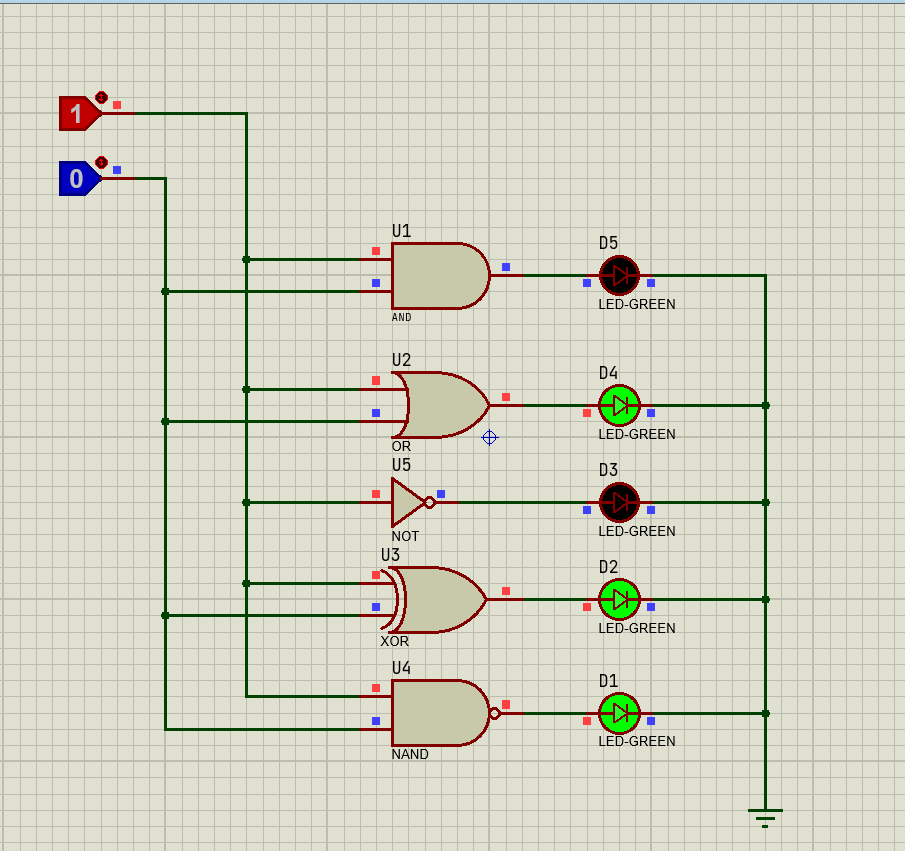
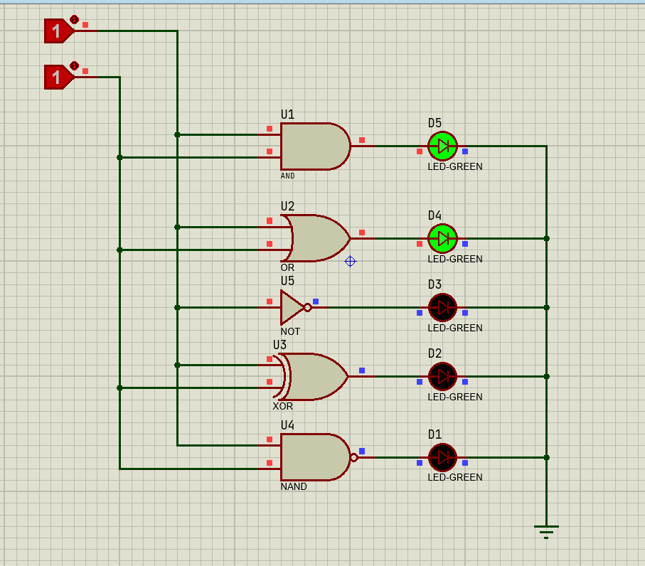

# Lab1

Implementation and Simulation of working of Logic gates *(and, or, not, xor, nand)* using [Proteus](https://www.labcenter.com/).

## Simulation

### Input 0, 0

### Input 0, 1

### Input 1, 0

### Input 1, 1

